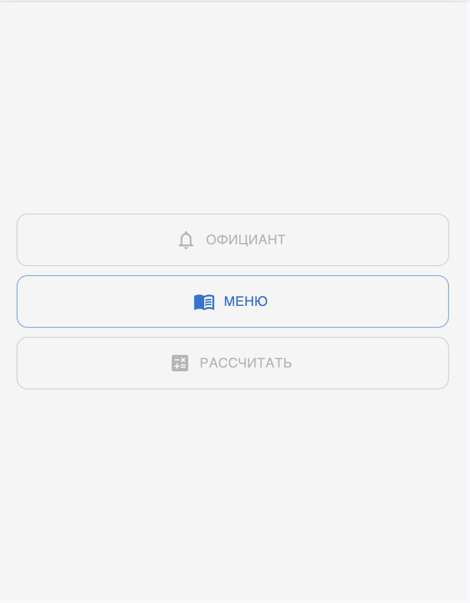

# 🍽️ 2kitchen – Restaurant Ordering Frontend

**Live Demo:** [https://2kitchen-frontend.vercel.app](https://2kitchen-frontend.vercel.app)

2kitchen is a modern web interface for restaurant ordering. The project allows customers to browse the menu and (in the future) request the bill or call a waiter. For businesses, an admin dashboard is provided to manage dishes, track orders, and view analytics like revenue, order statuses, and most popular items.

> ⚠️ Currently only the customer-side dish selection is implemented. Admin features and waiter interactions are planned in future versions.

---

## ✨ Features

- Responsive menu interface (mobile to desktop)
- Dish browsing and selection
- Admin dashboard (planned):
  - Manage dishes (add/edit/delete)
  - Track orders by day
  - View visual analytics (charts and graphs)
    - Revenue by day
    - Orders by status
    - Top-5 dishes
    - Average check size
- Modular component structure (planned UI-kit)
- Smooth adaptive styling for all screen sizes

---

## 🛠 Tech Stack

- **Frontend:** React + TypeScript
- **Styling:** Styled Components
- **State Management:** Zustand
- **Deployment:** Vercel

---

## 📸 Screenshots

> ℹ️ _To be added by the author. Recommended screenshots:_

1. 📱 **Mobile View** of the menu (smartphone width)
2. 💻 **Desktop View** with grid of dishes
3. 📊 (When ready) **Admin Dashboard Analytics** – charts, graphs
4. 🧭 (Optional) Navigation / Header / Interactions (e.g., add to cart)

Place images here using:

```md


```

---

## 🚀 Getting Started Locally

Clone the repo and run the app locally:

```bash
git clone https://github.com/pavloveone/2kitchen_frontend.git
cd 2kitchen_frontend
npm install
npm run start
```

> No `.env` file required at this stage. Runs on port `3000` by default.

---

## 📌 Roadmap

- [ ] Create design system / custom UI-kit
- [ ] Add cart functionality + order confirmation
- [ ] Implement waiter call + request bill
- [ ] Connect to backend API for dish/analytics data
- [ ] Add E2E tests (Playwright or Cypress)

---

## 🧑‍💻 Author

Alexander Pavlov  
[LinkedIn](https://linkedin.com/in/alexander-pavlov-877a422bb/)

---

## 📝 License

MIT – free to use and modify.
